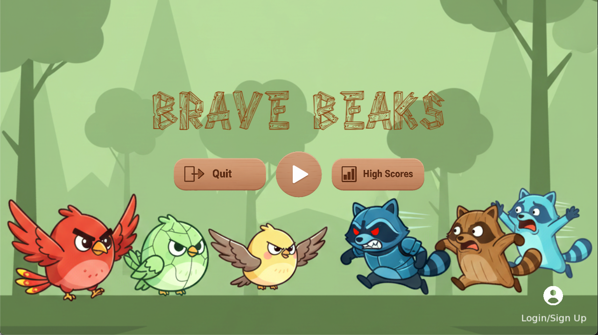
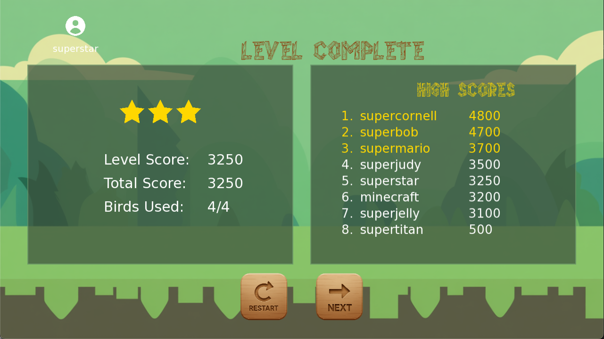
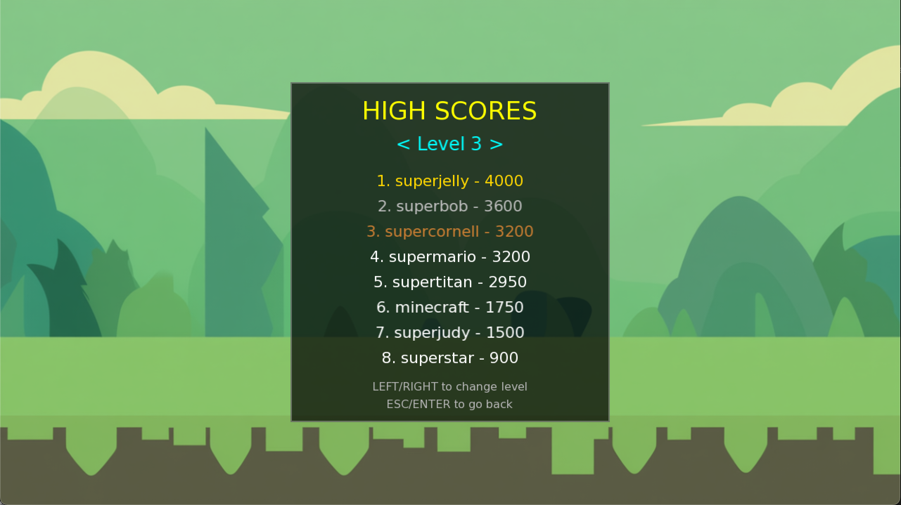

# Brave Beaks

## Demo Video
https://github.com/user-attachments/assets/85052b3c-0696-408d-a21d-4d79430076a8

**Brave Beaks** is a 2D physics-based puzzle game developed in C++ using the **SFML** (Simple and Fast Multimedia Library) for graphics/audio and **Box2D** for high-fidelity physics simulation. The game challenges players to utilize a slingshot mechanism to launch various birds, each with unique abilities, to destroy structures and defeat enemies.

---

## 1. Core Features

* **Advanced Physics Simulation:** Realistic 2D physics powered by `Box2D` for bird trajectories, entity collisions, and complex structural destruction.
* **Specialized Character System:** Multiple bird types with unique active abilities (e.g., Speed Boost, Triple Split, Explosive Impact).
* **Dynamic Environments:** Multi-layered structures made of wood, stone, glass, and metal, each with distinct physical properties and health.

* **Level Management:** Diverse levels with increasing difficulty, featuring custom layouts loaded dynamically from external data files.
* **Global Leaderboards & Auth:** Integrated `Supabase` backend for real-time online high-score tracking and secure user authentication.

* **Audio-Visual Experience:** Particle systems for environmental effects and a dedicated sound manager for immersive gameplay.

---

## 2. How to Play

This repository hosts the compiled binaries for the project. Source code is currently proprietary.

### Download Links
1. Navigate to the [Releases](../../releases) page of this repository.
2. **Windows**: Download `BraveBeaks_Windows.zip`. Extract the folder and run `BraveBeaks.exe`.
3. **macOS**: Download `BraveBeaks.dmg`. Open the disk image and drag the App to your Applications folder.

### System Requirements & Troubleshooting

#### For Windows Users:
* **Dependencies**: If you encounter an error stating that `MSVCP140.dll` or `VCRUNTIME140.dll` is missing, please install the [Microsoft Visual C++ Redistributable](https://aka.ms/vs/17/release/vc_redist.x64.exe).
* **Extraction**: Ensure you extract the entire ZIP file before running. The `.exe` requires the included `.dll` files and the `resources` folder to be in the same directory.

#### For macOS Users:
* **Security Permission**: Since the app is not signed by a registered Apple developer, you may see a security warning. To bypass this: **Right-click** the app, select **Open**, and then click **Open** again in the confirmation dialog.

---

## 3. Tech Stack
* **Language**: C++17
* **Frameworks**: SFML 2.6+, Box2D 2.4.x
* **Backend**: Supabase (PostgreSQL & Auth)
* **Networking**: cpp-httplib, nlohmann/json

---

## 4. Disclaimer
This software is developed for educational and portfolio purposes. All original artistic assets belong to their respective copyright holders.
